# Tâche 2 : Tests unitaires automatiques

## Binôme
- Bilal Vandenberge  
- Ilyas Ally Musaphur  


## Classes sélectionnées
Dans le cadre de cette tâche, nous avons choisi d’améliorer la couverture de tests sur les classes suivantes :  
- `GHUtility` (classe utilitaire contenant de nombreuses méthodes statiques liées à la manipulation de graphes)  
- `StopWatch` (classe permettant de mesurer le temps d’exécution d’un code de manière simple)  
- `AngleCalc` (classe permettant de convertir des azimuts en points cardinaux ou en angles relatifs aux axes)  

Ces classes avaient une couverture partielle, avec des méthodes non testées ou mal couvertes.  
Nos nouveaux tests ont permis de renforcer la robustesse de ces classes et d’améliorer le score de mutation.


## Documentation des tests

Chaque test est documenté avec :  
- **Nom du test**  
- **Intention** : comportement visé  
- **Données de test** : valeurs utilisées  
- **Oracle** : comportement attendu  
- **Justification** : pourquoi ce test est pertinent  


## GHUtilityTest

### 1. `testPathsEqualExceptOneEdgeSamePathsThrows` 
[voir le test dans le fichier source](../core/src/test/java/com/graphhopper/util/GHUtilityTest.java#L91)
- **Intention** : Vérifier que la méthode privée `pathsEqualExceptOneEdge` lève une exception si deux chemins identiques sont comparés.  
- **Données** : deux listes de nœuds `{1, 2, 3}`.  
- **Oracle** : `IllegalArgumentException`.  
- **Justification** : cette situation est explicitement interdite par le code source ; la tester garantit qu’un bug ne masquera pas ce comportement.  

### 2. `testGetAdj`
[voir le test dans le fichier source](../core/src/test/java/com/graphhopper/util/GHUtilityTest.java#L73)
- **Intention** : Vérifier que `getAdjNode` renvoie correctement le nœud adjacent d’une arête.  
- **Données** : graphe de 4 nœuds avec arête `(0, 3)`.  
- **Oracle** :  
  - `getAdjNode(graph, 0, 0)` → `0`.  
  - `getAdjNode(graph, 0, 3)` → `3`.  
- **Justification** : garantit le bon fonctionnement de la méthode pour un graphe simple.  

### 3. `testGetEdge`
[voir le test dans le fichier source](../core/src/test/java/com/graphhopper/util/GHUtilityTest.java#L81)
- **Intention** : Vérifier que `getEdge` récupère correctement une arête et ses informations associées.  
- **Données** : graphe avec deux arêtes : `(0, 3)` de distance `0.67`, et `(41, 42)`.  
- **Oracle** :  
  - `getEdge(graph, 0, 3).getBaseNode()` → `0`.  
  - `getEdge(graph, 42, 41).getBaseNode()` → `42`.  
  - `getEdge(graph, 0, 3).getDistance()` → `0.67`.  
- **Justification** : valide la récupération correcte des arêtes et distances.  


## StopWatchTest

### 4. `testToStringWithName`
[voir le test dans le fichier source](../core/src/test/java/com/graphhopper/util/StopWatchTest.java#L10)
- **Intention** : Vérifier que `toString()` inclut bien le nom donné et le temps écoulé.  
- **Données** : `StopWatch("customName")`.  
- **Oracle** : chaîne contient `"customName"` et `"time:"`.  
- **Justification** : assure la lisibilité des mesures.  

### 5. `testGetTimeStringZero`
[voir le test dans le fichier source](../core/src/test/java/com/graphhopper/util/StopWatchTest.java#L18)
- **Intention** : Vérifier la valeur par défaut du chronomètre non démarré.  
- **Données** : `new StopWatch()` sans `start()`.  
- **Oracle** : `"0ns"`.  
- **Justification** : confirme la robustesse dans un scénario de non-utilisation.  

### 6. `testGetMillisDoubleAfterSleep`
[voir le test dans le fichier source](../core/src/test/java/com/graphhopper/util/StopWatchTest.java#L24)
- **Intention** : Vérifier que la mesure du temps est correcte après une pause.  
- **Données** : `StopWatch.started()`, `Thread.sleep(10)`, puis `stop()`.  
- **Oracle** : valeur ≥ `9 ms`.  
- **Justification** : simule une utilisation réelle pour mesurer une durée d’exécution.  


## AngleCalcTest

### 7. `testAzimuth2compassPoint`
[voir le test dans le fichier source](../core/src/test/java/com/graphhopper/util/AngleCalcTest.java#L154)
- **Intention** : Vérifier que `azimuth2compassPoint` convertit correctement un azimut en points cardinaux.  
- **Données** : `22.0°, 67.0°, 112.0°, 157.0°, 202.0°, 247.0°, 292.0°, 337.0°`.  
- **Oracle** : `"N"`, `"NE"`, `"E"`, `"SE"`, `"S"`, `"SW"`, `"W"`, `"NW"`.  
- **Justification** : couvre les 8 points cardinaux principaux.  

### 8. `testConvertAzimuth2xaxisAngle`
[voir le test dans le fichier source](../core/src/test/java/com/graphhopper/util/AngleCalcTest.java#167)
- **Intention** : Vérifier que `convertAzimuth2xaxisAngle` convertit correctement un azimut en angle relatif à l’axe X et gère les valeurs invalides.  
- **Données** :  
  - `42.0° → 0.0775804 rad`.  
  - `90.0° → 1.54338 rad`.  
  - `269.0° → -3.1241 rad`.  
  - `361° → IllegalArgumentException`.  
  - `-1° → IllegalArgumentException`.  
- **Oracle** : valeurs numériques précises (±0.0001), exceptions pour valeurs invalides.  
- **Justification** : couvre les cas normaux et limites.  


## Tests avec java-faker

### 9. `testRandomSleepWithFaker`
[voir le test dans le fichier source](../core/src/test/java/com/graphhopper/util/StopWatchFakerTest.java#L11)
- **Intention** : Vérifier que `StopWatch` mesure correctement des temps d’attente générés aléatoirement.  
- **Données** : `java-faker` génère un entier entre 5 et 20 ms, utilisé comme durée de `Thread.sleep()`.  
- **Oracle** : la durée mesurée par `StopWatch` est supérieure ou égale au temps généré (avec une tolérance de 2 ms).  
- **Justification** : l’utilisation de `java-faker` permet d’éviter des valeurs fixes et de varier les scénarios de test pour améliorer la robustesse.  

## Résultats mutation (PITEST)

Nous avons exécuté **PITEST** sur les classes `GHUtility`, `StopWatch` et `AngleCalc`. Le plugin a été rajouté dans le pom.xml du module graphhopper.core (voir [ici](../core/pom.xml#L173)).

### Génération du rapport

Pour générer un rapport PIT dans `core/target/pit-reports/com.graphhopper.util/index.html`, éxecutez la commande:

```bash
mvn test-compile org.pitest:pitest-maven:mutationCoverage
```

dans le dossier `core`.

### Avant nos ajouts

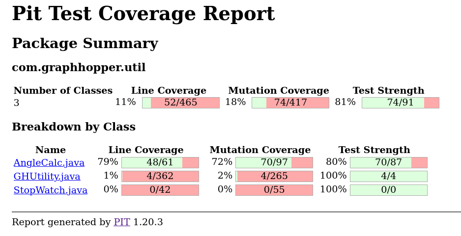

### Mutations tuées par nos ajouts

#### StopWatch

Dans la méthode StopWatch.toString, des mutations liées à la condition et la valeur de retour sont tuées par le test `StopWatchTest.testToStringWithName` car celui-ci vérifie le retour de cette méthode avec un oracle simple et précis:

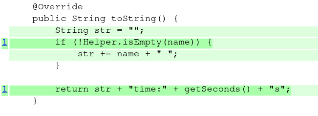

Dans la méthode `StopWatch.getTimeString`, la mutation qui retourne un string vide au lieu de "0ns" et la mutation qui rend négatif la condition elapsedNanos < 1e3 sont tuées. Cependant, la mutation qui inverse l'inégalité de cette condition survit car l'intention du test `StopWatchTest.testGetTimeStringZero` n'est pas de vérifier cette condition particulierement mais surtout qu'un chronomètre (StopWatch) non-démarré reste bien à 0ns:

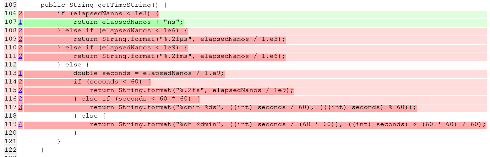

Le test `StopWatchTest.testGetMillisDoubleAfterSleep` permet de tuer les mutations qui retournent 0.0 pour `StopWatch.getMillisDouble` et qui retournent null pour `StopWatch.started`:

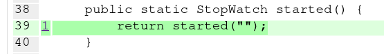
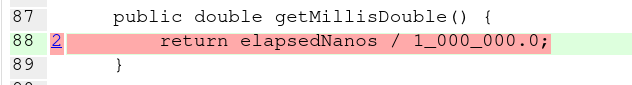

#### GHUtility

L'intention du test `GHUtilityTest.testPathsEqualExceptOneEdgeSamePathsThrows` est précisiement de s'assurer qu'une exception est bien lancée si les arguments sont incorrectes. C'est pour cela que la mutation qui inverse la condition de l'exception ne passe plus grâce à ce test:

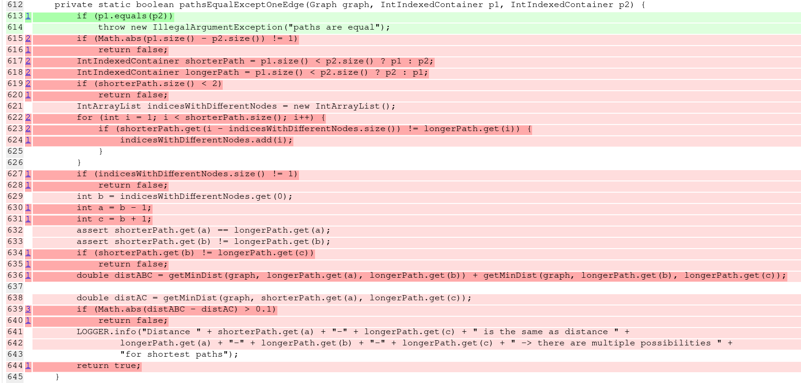

Beaucoup de mutations apparaissent dans les méthodes `GHUtility.getEdge` et `GHUtility.getAdjNode` car malgré l'impression que celles-ci semblent simples, elles sont relativement complexes. Les tests `GHUtiliyTest.testGetEdge` et `GHUtilityTest.testGetAdj` couvrent des mutations majeures sur les conditions dans les closes while et if ainsi que les valeurs de retour grâce à leurs oracles simple et efficace:

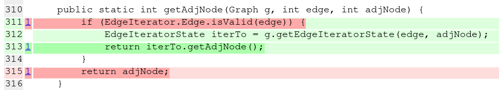
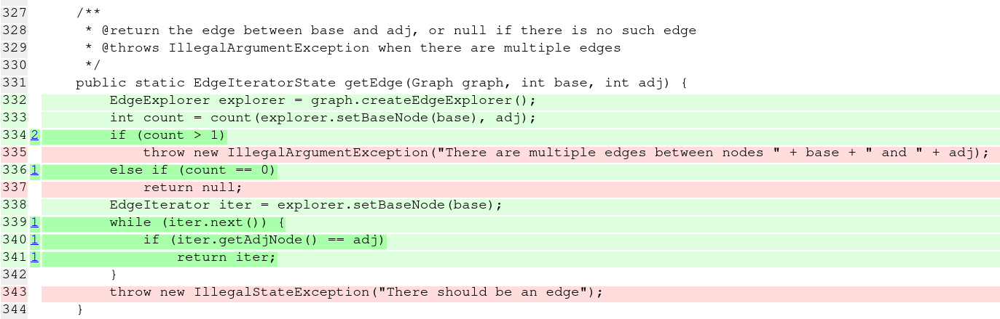

#### AngleCalcTest

Les mutations qui inverse les conditions des closes if, les mutations mathématiques et la mutation retournant un string vide au lieu de la valeur attendue dans `AngleCalc.azimuth2compassPoint` sont tuées par les 9 assertions du test `AngleCalcTest.testAzimuth2CompassPoint` visant chacune les 9 closes if:

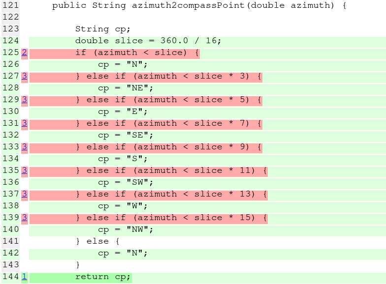

Finalement, des mutations mathématiques (changement des opérations), des mutations de valeur de retour et des conditions des closes if dans `AngleCalc.convertAzimuth2XAxisAngle` sont presque toutes tuées dans `AngleCalcTest.testConvertAzimuth2XAxisAngle` car les données de test ont été choisies spécialement pour couvrir plusieurs scénario de calcul dans cette méthode (test boite blanche):

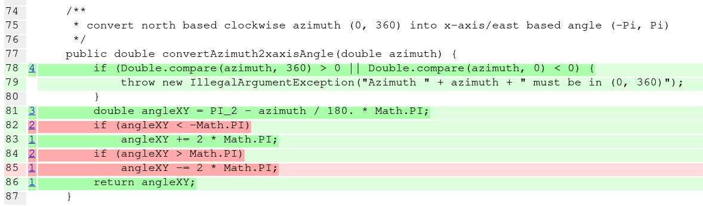

### Après nos ajouts 

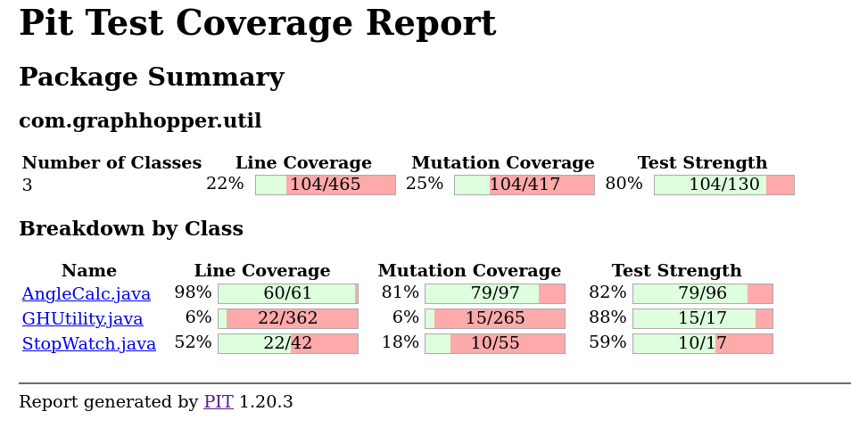

Ces résultats montrent que nos tests ont augmenté le score de mutation et renforcé la couverture effective.

## Résultats d’exécution
- Les **8 nouveaux tests** s’exécutent avec succès (`mvn test`).   
- Tous les tests passent également dans l’intégration continue (GitHub Actions).  


## Conclusion
- 9 nouveaux tests ajoutés (dont 1 avec java-faker)  
- Tous les tests passent localement et sur GitHub Actions
- Amélioration significative du score de mutation grâce aux nouveaux cas de test  
- Amélioration de la couverture du code:

Avant:
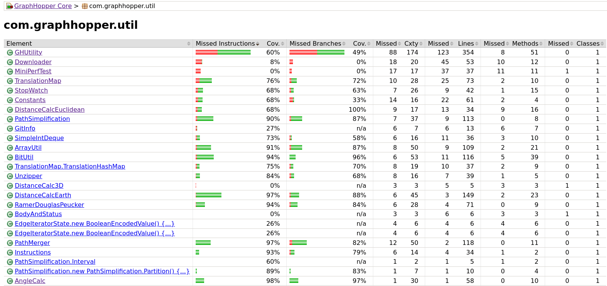
Après:
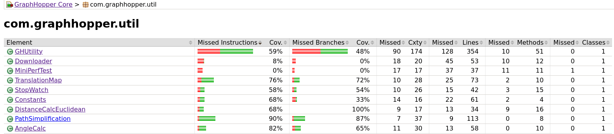